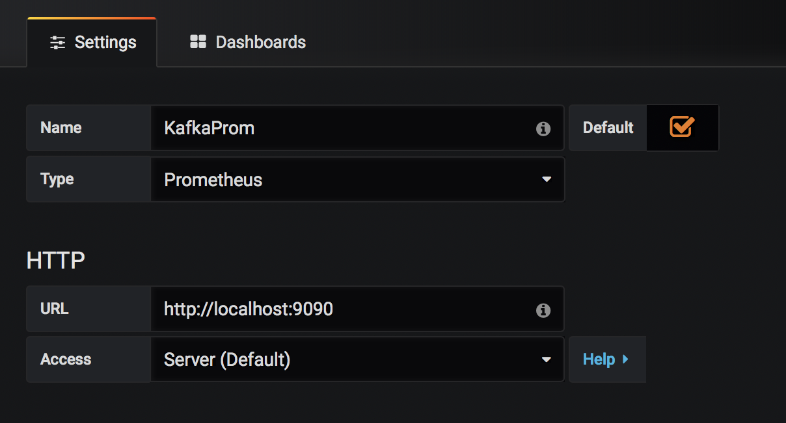
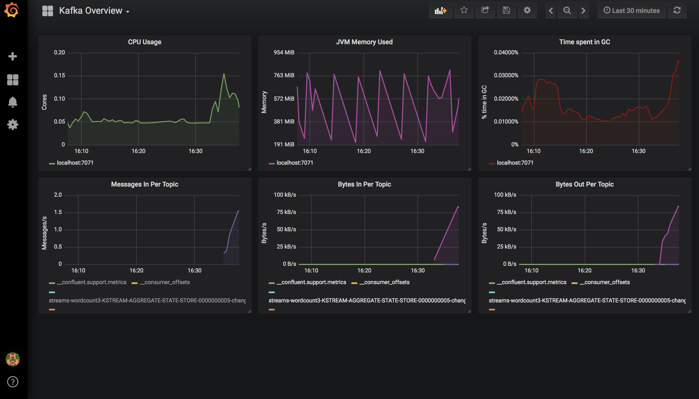

## Objectif
Monitoring les métriques kafka dans un grafana en s'aidant de prometheus.

## Ressources :

Récupérer les dernières version de ces éléments :

[jar : prometheus exporter](https://mvnrepository.com/artifact/io.prometheus.jmx/jmx_prometheus_javaagent)

[yml config : YML exemple config prometheus exporter](https://github.com/prometheus/jmx_exporter/tree/master/example_configs)

[prometheus :  release](https://github.com/prometheus/prometheus/releases)

[grafana ](https://grafana.com/get)


## Etapes

Ajouter dans le fichier bin/kafka-run-class ou avant de lancer le server start les infos pour exporter les metrics :

```
KAFKA_OPTS="$KAFKA_OPTS -javaagent:/[PATH...]/jmx_prometheus_javaagent-0.10.jar=7071:[PATH...]/prometheus-conf.yml"
```

Une fois le serveur kafka démarré, les métrics seront disponibles à :
http://localhost:7071/metrics
* * *
On va lancer un serveur prometheus pour lire et sauvegarder, pour cela il faut créer un fichier de configuration prometheus.yml :
```
global:
 scrape_interval: 10s
 evaluation_interval: 10s
scrape_configs:
 - job_name: 'kafka'
   static_configs:
    - targets:
      - localhost:7071
```

Lancer le serveur prometheus en pointant vers ce fichier

```
./prometheus --config.file=your_config.yml
```
* * *
Lancer grafana

Importer la datasource prometheus :



Importer le dashboard 721 (ce n'est qu'un exemple, ont peut en créer un selon nos besoins)


